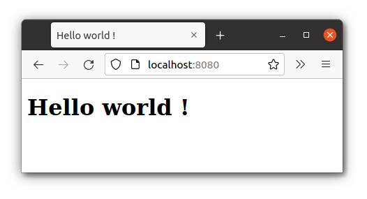

# Starter app Spring Boot Kotlin

Un support de formation

## Prérequis

* git opérationnel sur la machine
* IntelliJ opérationnel avec un jdk 17

Deux façons différentes de télécharger le projet test.

## (option 1) Cloner le projet 

Copier le lien : https://github.com/ldv-melun/sbfirst.git

Ouvrir une console (passage en ligne de commande) 

```
cd [dossier de travail]

git clone https://github.com/ldv-melun/sbfirst.git

```

Le dossier du projet est alors créé dans le dossier de travail.

## (option 2) ou Téléchargement le zip

Choisir `Downlad ZIP`


Puis le décompresser dans le dossier de travail.

## Ouvrir le projet 

Ouvrir le dossier du projet avec Intellij IDE

### Attention : Ouvrir le dossier du projet, et non son dossier parent.   


... et **attendre que les dépendances soient toutes téléchargées et indexées !** (consulter la barre d'état au bas de la fenêtre).

## En cas de problème

L'application `sbfirst` utilise [Apache Maven](https://maven.apache.org/) pour la gestion de ses dépendances.

Si vous utilisez des postes informatiques d'une organisation dont les connexions réseaux sont filtrées par un **proxy**, il vous faudra renseigner les données du proxy auprès de Maven.

Pour cela vous devez comprendre comment fonctionne Maven : Par défaut, les librairies dont dépend une application sont stockées dans un dossier nommé `.m2`, à la racine du compte utilisateur (le `home directory`). 

La solution consiste alors à créer un fichier nommé `settings.xml` à la racine de `.m2`, dont le contenu est basé sur ce schéma 

`~/.m2/settings.xml` (source : https://maven.apache.org/guides/mini/guide-proxies.html)
```
<settings xmlns="http://maven.apache.org/SETTINGS/1.0.0" xmlns:xsi="http://www.w3.org/2001/XMLSchema-instance"
  xsi:schemaLocation="http://maven.apache.org/SETTINGS/1.0.0 https://maven.apache.org/xsd/settings-1.0.0.xsd">
 
  <proxies>
    <proxy>
      <id>myproxy1</id>
      <active>true</active>
      <protocol>http</protocol>
      <host>proxy.somewhere.com</host>
      <port>8080</port>
    </proxy>
    <proxy>
      <id>myproxy2</id>
      <active>true</active>
      <protocol>https</protocol>
      <host>proxy.somewhere.com</host>
      <port>8080</port>
    </proxy>    
  </proxies>
 
</settings>
```

Remarque : le protocole `http` ou `https` est celui utilisé pour atteindre le proxy. À personnaliser ! 

## Build 

Une opération qui consiste, dans les grandes lignes,  à 

* précompiler             : kotlin -> java
* (si réussi) compiler    : java -> binaire


Les curieux pourront aller consulter le dossier `/target` qui contient les fichiers compilés.

## Lancement à partir de l'IDE

Pour lancer votre application web, il faut bien s'assurer d'avoir les 3 tiers web opérationnel. 

* Un client HTTP (un navigateur web fera l'affaire)
* Un serveur HTTP (l'IDE instancie un serveur apache tomcat pour vous - un plugin d'IntelliJ)  
* Un gestionnaire de base de données (sans ce tiers pour l'instant)

Il existe plusieurs façon de lancer votre application, c'est à dire un serveur Tomcat en fronta de votre application qui vient d'être compilée.

### Vérification de la configuration 

Vérification du lanceur : `Run/Edit configuration`


On choisira `Local machine` (le poste du développeur devra disposer des 3 tiers web pour être eligible dans ce cas - c'est le plus courant)

Corriger les erreurs de configuration éventuelles

### Lancement

Plusieurs possibilité 

* Panneau de gauche du projet, clic droit sur `SpringBootFirstApplication.kt`, puis `Run` (on peut faire de même avec les tests unitaires)

* Raccourci, `Maj F10` ou en cliquant sur l'icone en haut à droite


### Vérification

Vérifier que le lancement se soit bien déroulé.


### Activation par un client HTTP

Faire pointer un de vos navigateurs web sur : `localhost:8080`


Si vous obtenez ce résultat c'st que le contrôleur (méthode nommée `index` dans `MainController`) a bien fait son travail, et que votre machine est opérationnelle pour du développement web !

Le port `8080` est celui par défaut. 

Il peut être facilement changé en renseignant un nouveau port dans `application.properties`.  Faire une recherche sur le net pour trouver comment faire (`https://stackoverflow.com/` est votre ami)

## Bilan

Si vous êtes arrivé sans embuche (ou après correction), alors bravo, une petite pause bien méritée. 

Vous, et votre machine de dev, êtes maintenant opérationnels pour suivre la formation de développeur web !
